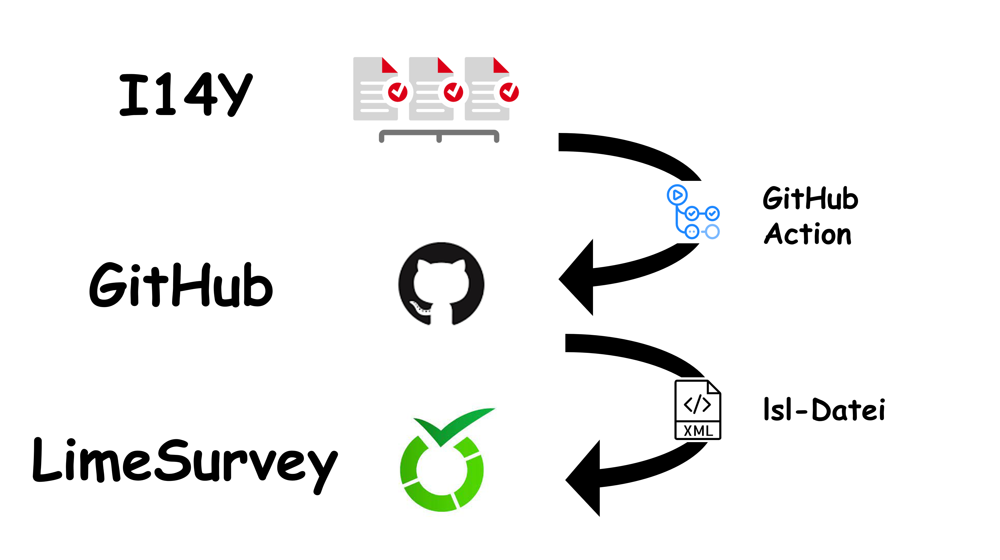
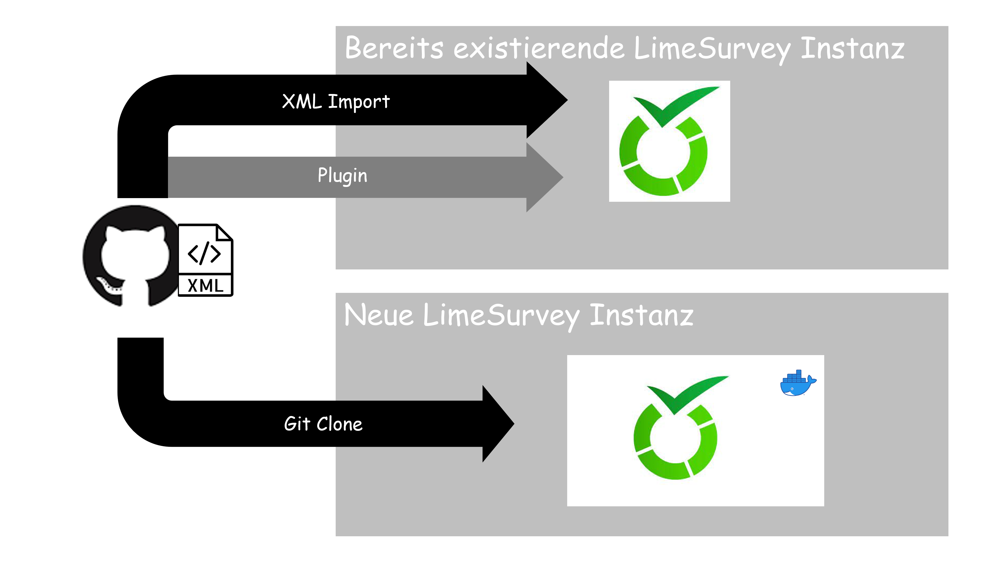
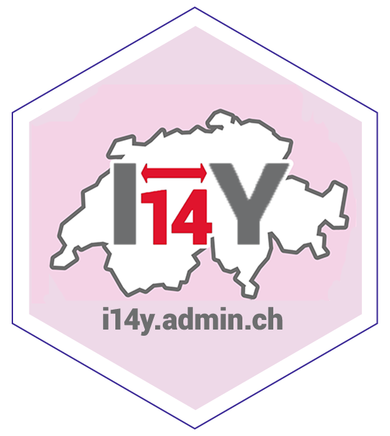

# iSurvey <!-- fit -->

---

<!-- Gestern habe ich euch Martin vorgestellt. Er arbeitet als Datenverantwortlicher im Amtshaus. -->

---

<!-- Seine Chefin hat ihn gebeten, eine Datensammlung zu aktualisieren. Mit einer Online-Umfrage. Dazu nutzt Martin die weit verbreitete Umfrage-Software Limesurvey. Denn damit lassen sich auch komplizierte Umfragen machen. Und: Er darf sie kostenlos benutzen. Soweit, so gut. -->

---

<!-- Doch nun realisiert Martin: Er muss die möglichen Ausprägungen jeder Variable manuell erfassen. Martin ist ein Datennerd wie aus dem Comic-Buch. Abtippen und Copy-Paste ist im ein Graus. -->

---

# ??? <!-- fit -->

<!-- Wie geht die Geschichte des fiktiven Beamten Martin weiter? -->

---

<!-- Muss er die dröge Arbeit wirklich machen, bis er am frühen Morgen vor Erschöpfung einnickt? -->

---

# Der Challenge 

Baue eine Brücke zwischen der I14Y-Interoperabilitätsplattform und Limesurvey. 

---

# Prozess

---

# Produkt

---

# Arbeitsablauf

--- 

<!-- Oder helft ihr ihm, so dass er es noch am späten Nachmittag auf den Tennisplatz schafft? -->

---

Mitarbeit: 

Bilder: Liebevoll gezeichnet von der künstlichen Intelligenz  [Comicai.ai](https://comicai.ai)
