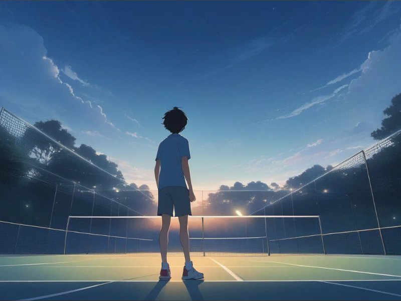

# iSurvey 

---

<!-- Gestern habe ich euch Martin vorgestellt. Er arbeitet als Datenverantwortlicher im Amtshaus. -->

---

<!-- Seine Chefin will wissen, mit welchen Fahrzeugarten die Einwohnerinnen und Einwohner unterwegs sind. Martin soll eine Online-Umfrage vorbereiten. Noch heute. Mit der Umfrage-Software Limesurvey. Denn damit lassen sich auch komplizierte Umfragen machen. Und vorallem: Denn sie darf kostenlos genutzt werden. -->

---

<!-- Auf der I14Y--Interoperabilitätsplattform entdeckt Martin zahlreiche Codelisten. Auch eine zu den Fahrzeugarten. Soweit, so gut. -->

---

<!-- Doch dann fragt sich Martin: Wie kriegt er all die Codelisten ins Umfragetool: Mit viel Abtippen und ebenso viel Copy-Paste? Martin ist ein Datennerd wie aus dem Comic-Buch. Manuelle und damit fehleranfällige Arbeiten sind ihm ein Graus. -->

---

<!-- Wie geht die Geschichte des fiktiven Beamten Martin weiter? Muss er wirklich seinen Feierabend opfern und die Nacht durcharbeiten, bis er frühmorgens vor Erschöpfung einnickt? -->

---

# Der Challenge 

Baue eine Brücke zwischen der I14Y-Interoperabilitätsplattform und Limesurvey. 

<!-- Mein Apell von gestern: Helft Martin. Baut eine Brücke zwischen der I14Y und Limesurvey. Eine Handvoll Entwicklern hat sich dem Problem angenommen. Hannes -- was habt ihr ausgeheckt? -->

---

# Prozess

---

# Architektur

---

# Produkt 

--- 

<!-- Die Gruppe steht kurz vor dem Abschluss der Arbeiten. Es ist also gut möglich, dass Martin die Nacht nicht durcharbeiten muss. Und es stattdessen noch am späten Nachmittag auf den Tennisplatz schafft? -->

---

__Challenge:__ I14Y.ch, Mathias Born

__Mitarbeit:__ Johannes Hool, Marc Stettler, Mario Bee, Nuno Canadas, Orhan Saeedi 

__Bilder:__ Liebevoll gezeichnet von der künstlichen Intelligenz  [Comicai.ai](https://comicai.ai)